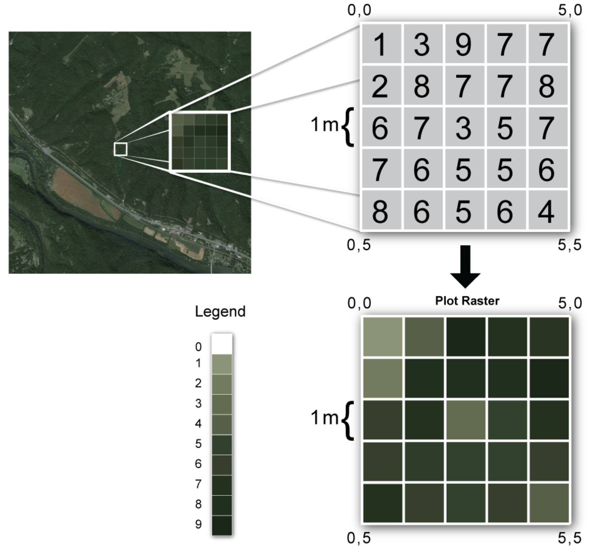
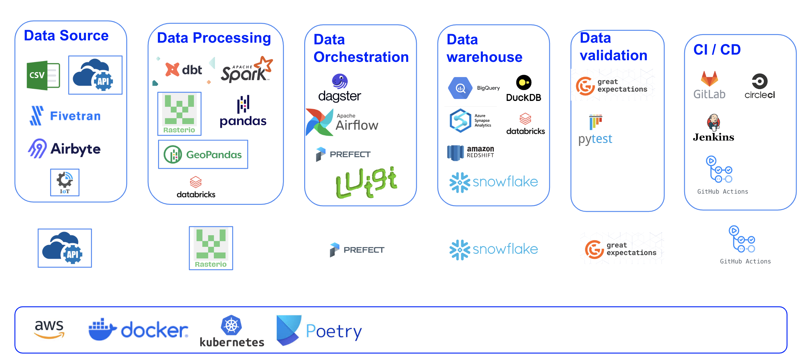
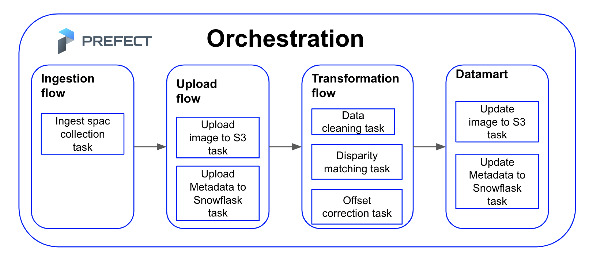

# Live EO Challenge
**Note: The code implementations are just draft and partial implementation, they can be improve to meet standard coding criteria**

## Objective:
Design and partially implement a scalable data ingestion pipeline that sources satellite imagery from the EarthSearch Data Catalog on demand, while also making the data available for additional internal systems to access once ingested. The system should be capable of handling configurable parameters such as timestamps, Area of Interest (AOI), and specific spectral bands.

## Tool Selection

### Data Orchestration Tool - Prefect

#### Why Prefect? Why not Airflow, Luigi, or Dagster?
- **Configurability and Parameterization:** Prefect excels in managing configurations like time steps, AOI, spectral bands, and other parameters with ease, making it highly adaptable to various needs.
- **Environment Management:** Prefect profiles allow seamless management of development and production environments, streamlining the transition between stages.
- **Dynamic Scheduling and Flow Dependencies:** Prefect's dynamic scheduling capabilities and improved flow dependencies enable efficient workflow management, ensuring tasks are executed in the correct sequence and at the right time.
- **Notification Management:** Built-in notification management ensures that you are alerted to any issues in real-time, allowing for prompt resolution.
- **Infrastructure and Team Management:** Prefect simplifies the management of infrastructure, teams, and programming languages, fostering collaboration and efficiency.
- **Security:** Prefect offers robust security features to protect configurations and interactions with external systems.

Prefect is designed for building observable and composable workflows from lightweight, modular components, including tasks, flows, subflows, deployments, and building blocks. Its secure configuration and extensive capabilities make it a superior choice for handling complex data orchestration needs.

### Data Ingestion Tool - PySTAC

PySTAC is a library tailored for working with SpatioTemporal Asset Catalogs (STAC). It is particularly suited for extracting data from STAC Catalogs, producing JSON output files. Here’s why PySTAC stands out:
- **Specialized for STAC:** PySTAC is the premier Python library for reading and writing STAC data, ensuring compatibility and efficiency.
- **Comprehensive Support:** It supports a wide range of STAC functionalities, making it the most detailed and reliable tool for working with STAC data in Python.

For more details, you can visit the [STAC Index Ecosystem](https://stacindex.org/ecosystem?language=Python).

### Data Storage and Data Warehouse - Amazon S3 and Snowflake

Snowflake is used to store and manage STAC catalog metadata, while Amazon S3 handles large binary files like images. Here’s why this combination is optimal:
- **Scalability and Performance:** Snowflake is a powerful cloud-based data warehousing solution that scales efficiently to handle large datasets with excellent performance.
- **Metadata Management:** Snowflake excels in managing complex metadata, making it ideal for storing STAC catalog metadata.
- **Integration with Cloud Storage:** Although Snowflake does not natively support large binary files, it integrates seamlessly with cloud object storage solutions like Amazon S3, Google Cloud Storage, or Azure Blob Storage, which are optimized for storing large image assets.
- **Data Integrity and Security:** Both Snowflake and Amazon S3 provide robust security features and ensure data integrity through built-in data protection mechanisms and compliance with industry standards.

### CI/CD Tool - GitHub Actions

GitHub Actions is chosen for continuous integration and continuous deployment (CI/CD) for several reasons:
- **Seamless Integration:** GitHub Actions integrates directly with GitHub repositories, simplifying the setup and maintenance of CI/CD pipelines.
- **Matrix Builds:** It supports matrix builds, enabling parallel testing across multiple configurations and improving efficiency.
- **Generous Free Tier:** GitHub Actions offers a generous free tier for both public and private repositories, making it a cost-effective solution for many projects.
- **Flexibility and Extensibility:** GitHub Actions provides a wide range of pre-built actions and allows custom workflows, catering to diverse CI/CD requirements.

## Workflow

This diagram visually represents the entire data ingestion pipeline, showing the flow of data from the STAC catalog through PySTAC, verification and storage in Snowflake and Amazon S3, data transformation, CI/CD processes, and final outputs.

The architecture and process flow of the data ingestion pipeline designed for handling SpatioTemporal Asset Catalog (STAC) and geospatial data. The pipeline leverages PySTAC for data ingestion, Snowflake for metadata storage, Amazon S3 for storing large binary files (e.g., images), and GitHub Actions for CI/CD. This setup ensures scalability, data integrity, and security throughout the process.

### Architecture Components and Process Flow

### Data Source

The primary data source in this architecture is the SpatioTemporal Asset Catalog (STAC), which provides raster data. To fetch data from this catalog, the PySTAC library is utilized. It is important to note that this architecture is designed for batch processing jobs as the STAC catalog does not support real-time or event-driven data.

### Data Fetching and Storage

**PySTAC Library**:
- **Function**: Fetches metadata and image URLs from the STAC catalog.
- **Output**: JSON files containing metadata and URLs to images.

**Storage Systems**:
- **Snowflake**: The JSON files with metadata are stored in Snowflake due to its scalability, data integrity, and security features.
- **Amazon S3**: Images, being large binary data, are stored in Amazon S3, which is a blob storage service suitable for handling large files.

### Considerations for Data Storage

Before selecting the data storage solutions, the following factors were considered:
- Scalability
- Data volume
- Size
- Frequency
- Integrity
- Data type

### Verification and Metadata Schema

**Verification Process**:
- A verification code is run to ensure all images stored in Amazon S3 have their corresponding metadata stored in Snowflake.

**Metadata Schema**:
- A schema is created in Snowflake to extract important information from the JSON files, storing it in a table. This facilitates easy querying of metadata information.

### Data Transformation

The data transformation stage involves several possible steps to ensure data quality and readiness for further use. These steps include:
- **Data Cleaning**: Removing inaccuracies and inconsistencies from the data.
- **Disparity Matching**: Aligning data from different sources to ensure consistency.
- **Offset Correction**: Adjusting data to correct any offsets.

After data transformation, the processed data is tested and verified to ensure all transformations were applied correctly. The transformed data, along with the metadata, is then stored in Snowflake and Amazon S3. The transformed images can be stored in a new bucket, and metadata in Snowflake is updated with information about the transformations and new locations.

### CI/CD and Data Output

**CI/CD Pipeline**:
- **GitHub Actions**: Used to run Continuous Integration and Continuous Deployment (CI/CD) processes.
- **Steps**:
  - Create new Docker images.
  - Deploy on Prefect (orchestration tool).
  - Check the quality of code and data.

**Final Outputs**:
- **Datamart**: Ready for use in various applications such as:
  - Analytics
  - AI/ML models
  - Generating reports
  - Creating dashboards

### Orchestration

The entire pipeline is orchestrated by Prefect, ensuring smooth and automated workflow management from data ingestion to final output.

### System Scalability, Data Integrity, and Security

- **Scalability:**
  - Snowflake and Amazon S3 are cloud-based solutions that scale seamlessly to handle varying loads, ensuring that the system can accommodate increasing data volumes without performance degradation.

- **Data Integrity:**
  - Prefect's robust scheduling and dependency management ensure that data processing workflows are executed correctly.
  - Snowflake's built-in data protection mechanisms maintain data integrity throughout storage and retrieval processes.
  - Verification steps for metadata and assets, as well as transformed data, ensure that all data adheres to predefined standards and correctness.

- **Security:**
  - Prefect and Snowflake offer secure configurations and interactions with external systems.
  - Amazon S3 provides robust access controls and encryption to protect stored images.
  - GitHub Actions secures the CI/CD pipeline through controlled access and automated security checks.

## Prefect Orchestration Pipeline

Basic orchestration pipeline using the Prefect orchestration tool. This pipeline serves as a starting point and can be expanded with additional features, flows, subflows, and tasks to meet more complex requirements.

The orchestration pipeline is divided into four main flows:

1. **Ingestion Flow**
2. **Upload Flow**
3. **Transformation Flow**
4. **Datamart**

### 1. Ingestion Flow

The ingestion flow is responsible for retrieving Spatial Temporal Asset Catalog (STAC) data from the STAC catalog. This flow includes the following task:

- **Ingest STAC Collection Task**: This task retrieves the STAC data, preparing it for the subsequent upload flow.

### 2. Upload Flow

The upload flow handles the storage of raw data into their appropriate storage solutions. This flow consists of two tasks:

- **Upload Image to S3 Task**: This task uploads raw images to an S3 bucket for storage.
- **Upload Metadata to Snowflake Task**: This task uploads the associated metadata to Snowflake, ensuring that all relevant data is stored efficiently and is accessible for transformation and analysis.

### 3. Transformation Flow

The transformation flow is a crucial part of the pipeline. It involves transforming the data into a format that can be easily consumed by other teams, as well as cleaning and improving the data quality. This flow includes the following tasks:

- **Data Cleaning Task**: This task cleans the data, removing any inconsistencies or errors to ensure data quality.
- **Disparity Matching Task**: This task matches disparities within the data to align and standardize it for further processing.
- **Offset Correction Task**: This task corrects any offsets in the data to ensure accuracy and reliability.

### 4. Datamart

The datamart flow is responsible for storing and updating metadata and other forms of data for future use. This flow includes two tasks:

- **Update Image to S3 Task**: This task updates the images in the S3 bucket, ensuring that the most recent and accurate images are available.
- **Update Metadata to Snowflake Task**: This task updates the metadata in Snowflake, keeping the data current and accessible for analysis and reporting.

## Future Enhancements

This basic orchestration pipeline can be expanded with additional features, flows, subflows, and tasks to accommodate more complex data processing requirements. Future enhancements may include:

### Enhanced Data Validation
- **Additional Data Validation Tasks:** Implementing more rigorous data validation tasks will help ensure data integrity at every stage of the pipeline. This includes schema validation, completeness checks, and consistency checks to prevent corrupt or malformed data from propagating through the system. 

### Advanced Data Transformation and Enrichment
- **More Advanced Data Transformation and Enrichment Processes:** As data processing requirements become more sophisticated, the pipeline should include advanced data transformation and enrichment processes. This could involve complex aggregations, machine learning model applications, and data normalization techniques to enhance the quality and usability of the data.

### Enhanced Monitoring and Logging
- **Enhanced Monitoring and Logging:** Implementing comprehensive monitoring and logging mechanisms will improve observability and error tracking. Tools like Prefect’s logging features, combined with external monitoring systems, can provide real-time insights and detailed error reports, facilitating quicker issue resolution and more effective pipeline management.

### Automated Notification Systems
- **Automated Notification Systems:** Setting up automated notification systems, such as Slack messages, emails, or webhook alerts, can inform stakeholders of pipeline status, any detected issues, or critical updates. This proactive communication strategy ensures timely interventions and keeps everyone informed about the pipeline's operations.

### Pipeline Monitoring
- **Pipeline Monitoring:** Integrating advanced logging features within Prefect to send notifications via Slack or email when anomalies or specific events occur will enhance real-time monitoring and response capabilities. This could include status updates on task completions, warnings on potential issues, or alerts for failures.

### Pipeline Resilience
- **Pipeline Resilience:** Utilizing Prefect’s retry and retry delay features can improve the pipeline’s resilience, especially when interacting with external APIs or libraries like PySTAC. If an API does not respond as expected, these features allow for automatic retries with specified delays, increasing the likelihood of successful data retrieval without manual intervention.

### Pipeline Configuration
- **Pipeline Configuration:** Leveraging Prefect’s variables and profile features can streamline the configuration process. These tools enable dynamic configuration of pipeline parameters, making it easier to adapt to different environments and input requirements without hardcoding values, thus enhancing flexibility and maintainability.

### Pipeline Scalability
- **Pipeline Scalability:** To improve scalability, each flow within the pipeline can be containerized using Docker and orchestrated with Kubernetes. This approach allows for horizontal scaling of the pipeline, where multiple instances of the flow can be run concurrently to handle larger volumes of data efficiently. Kubernetes also provides robust management of containerized applications, ensuring high availability and efficient resource utilization.

In conclusion, these enhancements will significantly augment the pipeline’s capability, reliability, and adaptability, ensuring it meets the growing and evolving needs of data processing tasks.

## Folder Structure
**.github/**
  - **workflows/**: Contains GitHub Actions workflows for continuous integration and deployment.
  - **ISSUE_TEMPLATE/**: Templates for creating GitHub issues.
  - **PULL_REQUEST_TEMPLATE.md**: Template for pull request descriptions.

**flows/**
  - **ingestion/**: Prefect flows for data ingestion.
  - **processing/**: Prefect flows for data processing.
  - **validation/**: Prefect flows for data validation.

**notebooks/**
  - **exploratory/**: Jupyter notebooks for data exploration and analysis.
  - **experimental/**: Jupyter notebooks for experimental analysis and prototyping.

**resources/**
  - **images/**: Images used in the README and documentation.
  - **configs/**: Configuration files used in the project.
  - **sql/**: SQL scripts used for querying databases.

**scripts/**
  - **setup/**: Scripts for initial project setup and configuration.
  - **utils/**: Utility scripts that can be used across multiple modules.
  - **testing/**: Scripts for running tests.

**tests/**
  - **unit/**: Unit tests for individual functions and modules.
  - **integration/**: Integration tests to ensure different parts of the system work together.
  - **e2e/**: End-to-end tests to validate the complete data pipeline.

**logs/**: Contains logs generated by the data pipeline for monitoring and debugging.

**docs/**
  - **source/**: Source files for generating documentation.
  - **build/**: Generated documentation files.
  - **README.md**: Main project README file with an overview and instructions.

**.env**: Environment variables file used during setup for storing secrets and configuration.

**makefile**: Contains all the necessary commands so you don't need to remember every command.

**pyproject.toml**: This is used for managing dependencies and project metadata.

**requirements.txt**: List of Python dependencies required for the project.

**.gitignore**: Specifies files and directories to be ignored by Git.

