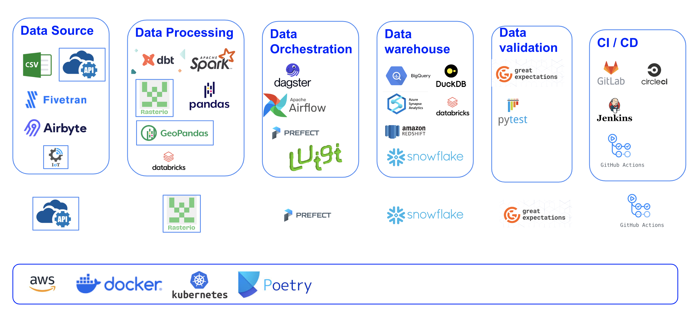
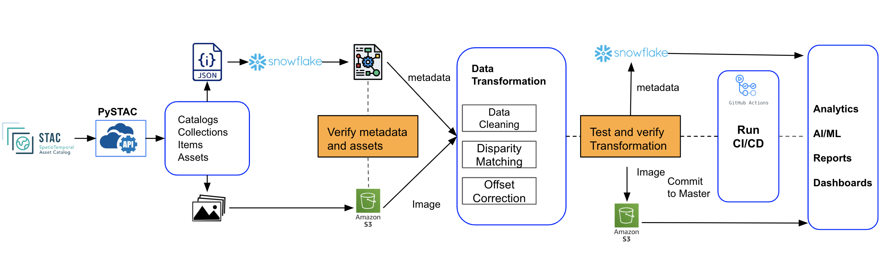
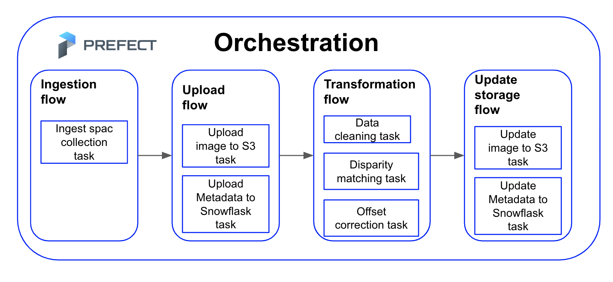

# Live EO Challenge

## Objective:
Design and partially implement a scalable data ingestion pipeline that sources satellite imagery from the EarthSearch Data Catalog on demand, while also making the data available for additional internal systems to access once ingested. The system should be capable of handling configurable parameters such as timestamps, Area of Interest (AOI), and specific spectral bands.

## Tool Selection

### Data Orchestration Tool - Prefect

#### Why Prefect? Why not Airflow, Luigi, or Dagster?
- **Configurability and Parameterization:** Prefect excels in managing configurations like time steps, AOI, spectral bands, and other parameters with ease, making it highly adaptable to various needs.
- **Environment Management:** Prefect profiles allow seamless management of development and production environments, streamlining the transition between stages.
- **Dynamic Scheduling and Flow Dependencies:** Prefect's dynamic scheduling capabilities and improved flow dependencies enable efficient workflow management, ensuring tasks are executed in the correct sequence and at the right time.
- **Notification Management:** Built-in notification management ensures that you are alerted to any issues in real-time, allowing for prompt resolution.
- **Infrastructure and Team Management:** Prefect simplifies the management of infrastructure, teams, and programming languages, fostering collaboration and efficiency.
- **Security:** Prefect offers robust security features to protect configurations and interactions with external systems.

Prefect is designed for building observable and composable workflows from lightweight, modular components, including tasks, flows, subflows, deployments, and building blocks. Its secure configuration and extensive capabilities make it a superior choice for handling complex data orchestration needs.

### Data Ingestion Tool - PySTAC

PySTAC is a library tailored for working with SpatioTemporal Asset Catalogs (STAC). It is particularly suited for extracting data from STAC Catalogs, producing JSON output files. Here’s why PySTAC stands out:
- **Specialized for STAC:** PySTAC is the premier Python library for reading and writing STAC data, ensuring compatibility and efficiency.
- **Comprehensive Support:** It supports a wide range of STAC functionalities, making it the most detailed and reliable tool for working with STAC data in Python.

For more details, you can visit the [STAC Index Ecosystem](https://stacindex.org/ecosystem?language=Python).

### Data Storage and Data Warehouse - Amazon S3 and Snowflake

Snowflake is used to store and manage STAC catalog metadata, while Amazon S3 handles large binary files like images. Here’s why this combination is optimal:
- **Scalability and Performance:** Snowflake is a powerful cloud-based data warehousing solution that scales efficiently to handle large datasets with excellent performance.
- **Metadata Management:** Snowflake excels in managing complex metadata, making it ideal for storing STAC catalog metadata.
- **Integration with Cloud Storage:** Although Snowflake does not natively support large binary files, it integrates seamlessly with cloud object storage solutions like Amazon S3, Google Cloud Storage, or Azure Blob Storage, which are optimized for storing large image assets.
- **Data Integrity and Security:** Both Snowflake and Amazon S3 provide robust security features and ensure data integrity through built-in data protection mechanisms and compliance with industry standards.

### CI/CD Tool - GitHub Actions

GitHub Actions is chosen for continuous integration and continuous deployment (CI/CD) for several reasons:
- **Seamless Integration:** GitHub Actions integrates directly with GitHub repositories, simplifying the setup and maintenance of CI/CD pipelines.
- **Matrix Builds:** It supports matrix builds, enabling parallel testing across multiple configurations and improving efficiency.
- **Generous Free Tier:** GitHub Actions offers a generous free tier for both public and private repositories, making it a cost-effective solution for many projects.
- **Flexibility and Extensibility:** GitHub Actions provides a wide range of pre-built actions and allows custom workflows, catering to diverse CI/CD requirements.

In conclusion, these tools were selected for their superior capabilities in their respective domains, ensuring efficient, secure, and scalable handling of data orchestration, ingestion, storage, and CI/CD processes.

## Workflow

This diagram visually represents the entire data ingestion pipeline, showing the flow of data from the STAC catalog through PySTAC, verification and storage in Snowflake and Amazon S3, data transformation, CI/CD processes, and final outputs.

This document outlines the architecture and process flow of the data ingestion pipeline designed for handling SpatioTemporal Asset Catalog (STAC) and geospatial data. The pipeline leverages PySTAC for data ingestion, Snowflake for metadata storage, Amazon S3 for storing large binary files (e.g., images), and GitHub Actions for CI/CD. This setup ensures scalability, data integrity, and security throughout the process.

### Architecture Components and Process Flow

### Data Source

The primary data source in this architecture is the SpatioTemporal Asset Catalog (STAC), which provides raster data. To fetch data from this catalog, the PySTAC library is utilized. It is important to note that this architecture is designed for batch processing jobs as the STAC catalog does not support real-time or event-driven data.

### Data Fetching and Storage

**PySTAC Library**:
- **Function**: Fetches metadata and image URLs from the STAC catalog.
- **Output**: JSON files containing metadata and URLs to images.

**Storage Systems**:
- **Snowflake**: The JSON files with metadata are stored in Snowflake due to its scalability, data integrity, and security features.
- **Amazon S3**: Images, being large binary data, are stored in Amazon S3, which is a blob storage service suitable for handling large files.

### Considerations for Data Storage

Before selecting the data storage solutions, the following factors were considered:
- Scalability
- Data volume
- Size
- Frequency
- Integrity
- Data type

### Verification and Metadata Schema

**Verification Process**:
- A verification code is run to ensure all images stored in Amazon S3 have their corresponding metadata stored in Snowflake.

**Metadata Schema**:
- A schema is created in Snowflake to extract important information from the JSON files, storing it in a table. This facilitates easy querying of metadata information.

### Data Transformation

The data transformation stage involves several possible steps to ensure data quality and readiness for further use. These steps include:
- **Data Cleaning**: Removing inaccuracies and inconsistencies from the data.
- **Disparity Matching**: Aligning data from different sources to ensure consistency.
- **Offset Correction**: Adjusting data to correct any offsets.

After data transformation, the processed data is tested and verified to ensure all transformations were applied correctly. The transformed data, along with the metadata, is then stored in Snowflake and Amazon S3. The transformed images can be stored in a new bucket, and metadata in Snowflake is updated with information about the transformations and new locations.

### CI/CD and Data Output

**CI/CD Pipeline**:
- **GitHub Actions**: Used to run Continuous Integration and Continuous Deployment (CI/CD) processes.
- **Steps**:
  - Create new Docker images.
  - Deploy on Prefect (orchestration tool).
  - Check the quality of code and data.

**Final Outputs**:
- **Datamart**: Ready for use in various applications such as:
  - Analytics
  - AI/ML models
  - Generating reports
  - Creating dashboards

### Orchestration

The entire pipeline is orchestrated by Prefect, ensuring smooth and automated workflow management from data ingestion to final output.

### System Scalability, Data Integrity, and Security

- **Scalability:**
  - Snowflake and Amazon S3 are cloud-based solutions that scale seamlessly to handle varying loads, ensuring that the system can accommodate increasing data volumes without performance degradation.

- **Data Integrity:**
  - Prefect's robust scheduling and dependency management ensure that data processing workflows are executed correctly.
  - Snowflake's built-in data protection mechanisms maintain data integrity throughout storage and retrieval processes.
  - Verification steps for metadata and assets, as well as transformed data, ensure that all data adheres to predefined standards and correctness.

- **Security:**
  - Prefect and Snowflake offer secure configurations and interactions with external systems.
  - Amazon S3 provides robust access controls and encryption to protect stored images.
  - GitHub Actions secures the CI/CD pipeline through controlled access and automated security checks.

Important block 
Secret - A block that represents a secret value. 
Snowflake Credentials - Block used to manage authentication with Snowflake.
Snowflake Connector - Perform data operations against a Snowflake database.
Docker Container- Runs a command in a container. Requires a Docker Engine to be connectable.
AWS Credentials - Block used to manage authentication with AWS.
AWS Secret - Manages a secret in AWS's Secrets Manager.
Slack Webhook - Enables sending notifications via a provided Slack webhook.

Step by step 
- create dev profile with scripts/create_dev_profile.bash script
- create SnowflakeCredentials  block 
- add credentials to SnowflakeCredentials block either manually of using dotenv library and .env 
